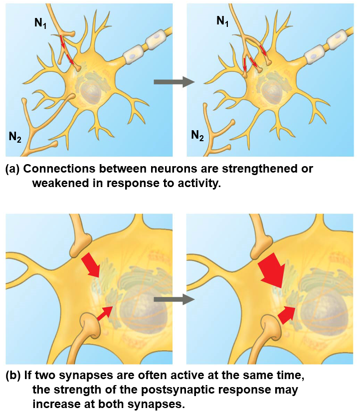

# 神经系统

## 神经递质

脑与脊髓中最常见的神经递质是谷氨酸，分布于超过 90% 的兴奋型突触。脑中第二常见的神经递质是 γ-氨基丁酸，分布于超过90%的抑制型且不使用谷氨酸的突触。

大部分的神经递质即可以作用于下一个神经元，也可以作用于靶细胞。

### 常见神经递质

- **血清素（Serotonin）**：主要作用于大脑中的其他神经元，调节情绪、食欲和睡眠等功能。

- **多巴胺（Dopamine）**：在大脑中，主要作用于其他神经元，涉及奖励、动机、注意力和运动控制。

- **乙酰胆碱（Acetylcholine）**：在中枢神经系统中，作用于其他神经元，涉及记忆和学习；在外周神经系统中，作用于肌肉细胞，促进肌肉收缩。

- **谷氨酸（Glutamate）**：主要作用于下一个神经元，通过突触传递兴奋性信号，涉及学习和记忆。

- **γ-氨基丁酸（GABA）**：主要作用于下一个神经元，通过突触传递抑制性信号，调节神经元的兴奋性，维持神经系统的平衡。

- **催产素（Oxytocin）**：既可以作用于大脑中的神经元，调节情感和社会行为，也可以通过血液循环作用于子宫和乳腺等靶细胞，促进分娩和泌乳。

- **褪黑素（Melatonin）**：主要通过血液循环作用于各种靶细胞，调节睡眠-觉醒周期。

- **去甲肾上腺素（Norepinephrine）**：在中枢神经系统中，作用于其他神经元，调节注意力和情绪；在外周神经系统中，通过血液循环作用于心脏、血管等靶细胞，调节心率和血压。

- **内啡肽（Endorphins）**：主要在大脑中作用于神经元，发挥镇痛和愉悦作用，但也可以通过血液循环作用于其他靶细胞。

- **一氧化氮（NO）**：

- **苯乙胺（Phenylethylamine）**：可以作用于大脑中的神经元，提升情绪和愉悦感；同时也可以通过血液循环作用于其他靶细胞。

- **一氧化氮（NO）**：既可以作用于下一个神经元，调节突触可塑性和神经元的兴奋性；也可以作用于血管平滑肌等靶细胞，导致血管扩张，调节血流和血压；也可以作用于其他靶细胞，通过扩散和激活信号通路调节多种生理功能。

### 系统中主要的神经递质

- 脑系统
  - 谷氨酸：兴奋性神经递质
  - GABA：抑制性神经递质

- 自主神经系统（交感-副交感系统）
  - 去甲肾上腺素：交感神经递质
  - 乙酰胆碱：副交感神经递质

### 特殊的神经递质：神经肽

神经肽是一类大分子的神经递质（多肽），与小分子不同，神经肽在细胞体合成，通过长距离运输，在突触释放；小分子则是直接在突触前体合成并释放。

#### 内源性神经肽

脑啡肽（Enkephalin）、内啡肽（Endorphin）和强啡肽（Dynorphin）是三种内源性肽类，它们在人体内发挥着重要的生理作用，尤其在疼痛调节和情绪控制方面。以下是它们的主要作用：

- **脑啡肽（Enkephalin）**：脑啡肽是一类小分子肽，主要存在于中枢神经系统和外周神经系统。它们的主要作用包括：
  - 镇痛作用：脑啡肽与阿片受体结合，特别是 δ（delta）受体，能有效减轻疼痛。
  - 情绪调节：脑啡肽在情绪调节中起重要作用，有助于缓解焦虑和抑郁情绪。
  - 神经传递调控：脑啡肽在神经传递过程中起到调节作用，影响神经元的兴奋性。

- **内啡肽（Endorphin）**：内啡肽是一类较大的多肽，主要在脑和脊髓中发现。它们的主要作用包括：
  - 强效镇痛：内啡肽与 μ（mu）阿片受体结合，产生强效的镇痛作用，常被称为“天然的止痛药”。
  - 愉悦感和幸福感：内啡肽的释放与愉悦感和幸福感密切相关，能够提升情绪，减少压力和焦虑。
  - 免疫调节：内啡肽还参与免疫系统的调节，影响免疫细胞的功能。

- **强啡肽（Dynorphin）**：强啡肽是一类多肽，主要作用在 κ（kappa）阿片受体上。它们的主要作用包括：
  - 镇痛作用：强啡肽通过与κ受体结合，产生镇痛效果，但其作用机制与脑啡肽和内啡肽有所不同。
  - 情绪和行为调控：强啡肽在调节情绪和行为方面起到重要作用，过量的强啡肽可能与负面情绪和应激反应相关。
  - 神经保护：强啡肽在神经系统的损伤和修复过程中也发挥一定的保护作用。

## 电信号传递

### 神经系统：局部场电位（Local Field Potential） 

LFP 是通过在脑组织的局部区域测量电势变化来获取的，通常使用微电极在小范围内记录。

LFP是由局部神经元的集体活动所产生的。当神经元集群同时发放动作电位时，它们产生的电流会在周围的组织中传播。这些电流在脑组织中的传播会引起细胞外液中的电势变化，形成 LFP 信号。

LFP 主要反映了局部神经元活动的总体情况，包括神经元的兴奋和抑制状态、突触传递和神经元网络的同步性等。

> 脑电波是群体神经元活动的集合表现形式

### 单个神经元：动作电位（Action Potential）

> 这张图展示了神经元动作电位的形成过程及其相关的离子通道活动。以下是图中出现的名词解释：
> 
> - **膜电位（Membrane Potential）**：
>    - 指细胞膜两侧的电位差，通常用毫伏（mV）表示。
> 
> - **静息状态（Resting State）**：
>    - 神经元在未被激活时的状态，膜电位通常为-70mV左右。
> 
> - **阈值电位（Threshold Potential）**：
>    - 引发动作电位所需的最低膜电位，一般在-55mV左右。
> 
> - **去极化（Depolarization）**：
>    - 膜电位变得不那么负，甚至变为正值的过程，通常是由于钠离子（Na⁺）进入细胞引起的。
> 
> - **复极化（Repolarization）**：
>    - 膜电位恢复到负值的过程，通常是由于钾离子（K⁺）离开细胞引起的。
> 
> - **超极化（Hyperpolarization）**：
>    - 膜电位变得比静息电位更负的过程。
> 
> - **绝对不应期（Absolute Refractory Period）**：
>    - 在这一期间，无论刺激多强，细胞都不能再次产生动作电位。
> 
> - **相对不应期（Relative Refractory Period）**：
>    - 在这一期间，需要比平时更强的刺激才能引发新的动作电位。
> 
> - **钠钾泵（Na⁺/K⁺ ATPase）**：
>    - 一种用ATP提供能量的膜蛋白，负责将3个Na⁺泵出细胞，2个K⁺泵入细胞，维持静息电位。
> 
> - **钠离子通道（Na⁺ Channel）**：
>     - 在动作电位的去极化阶段打开，允许Na⁺进入细胞。
> 
> - **钾离子通道（K⁺ Channel）**：
>     - 在动作电位的复极化阶段打开，允许K⁺离开细胞。
> 
> - **外界刺激（External Stimulus）**：
>     - 引发神经元发生动作电位的外部因素。
> 
> - **非门控钾通道（Non-Gated K⁺ Channel）**：
>     - 始终开放的钾通道，帮助维持静息电位。
> 
> 图中A部分展示了动作电位的时间变化过程，B部分展示了钠离子和钾离子通透性的变化，C部分展示了不同阶段的离子通道活动。

## 神经元对输入信号的处理

> 这张图展示了神经元是如何根据输入的刺激来决定输出的刺激，具体通过以下几种机制来实现：
> 
> - **阈下刺激，无总和 (Subthreshold, no summation)**：
>    - 如图(a)所示，当单个输入刺激（E1）的强度不足以达到神经元的阈值时，神经元不会产生动作电位。此时，膜电位会发生小幅度变化，但不会触发神经冲动的传导。
> 
> - **时间总和 (Temporal summation)**：
>    - 如图(b)所示，当同一输入刺激（E1）在短时间内多次重复出现时，膜电位的变化会累积起来。如果这些累积的变化超过了阈值，神经元就会产生动作电位（Action potential）。这说明时间总和可以使得单个输入刺激通过频繁重复达到触发神经冲动的效果。
> 
> - **空间总和 (Spatial summation)**：
>    - 如图(c)所示，当多个不同的输入刺激（E1和E2）同时作用于神经元时，这些刺激的效应可以在空间上累积。如果累积效应超过了阈值，神经元同样会产生动作电位。空间总和说明了多个输入可以协同作用来触发神经冲动。
> 
> - **兴奋性和抑制性突触后电位的空间总和 (Spatial summation of EPSP and IPSP)**：
>    - 如图(d)所示，当兴奋性输入（E1）和抑制性输入（I）同时作用于神经元时，它们的效应会相互抵消。兴奋性突触后电位（EPSP）会使膜电位趋向于阈值，而抑制性突触后电位（IPSP）则会使膜电位远离阈值。如果抑制性输入的效应足够强，可能会阻止兴奋性输入触发动作电位。
> 
> 总结：
> - 神经元根据输入刺激的强度和频率来决定是否产生动作电位。
> - 当输入刺激使膜电位超过阈值时，神经元会产生动作电位（神经冲动）。
> - 如果输入刺激不足以使膜电位达到阈值，神经元不会产生动作电位。
> 
> 这张图形象地展示了神经元的“全或无”原则：只有当输入刺激足够强大时，才会引发动作电位，否则不会有输出。

## 神经可塑性：主要来自突触可塑性

神经可塑性主要反映在突触上，原因如下：

1. **突触连接的强化或削弱**：如图(a)所示，神经元之间的连接可以根据活动的频率和强度被强化或削弱。这意味着当神经元之间的信号传递频繁且强烈时，突触连接会被强化；反之，当信号传递较少或较弱时，突触连接会被削弱。这种变化直接影响了神经元之间的通信效率和信号传递能力，是神经可塑性的一个重要体现。

2. **突触反应强度的增加**：如图(b)所示，当两个突触经常同时活跃时，突触后反应的强度可能在这两个突触处同时增加。这表明突触的活动模式和频率可以直接影响突触后神经元的反应强度，从而改变神经网络的功能和信息处理能力。

3. **神经系统的适应性**：神经可塑性描述了神经系统在出生后能够被修改的能力，而这种能力主要通过突触的变化来实现。突触是神经元之间进行信息传递的关键部位，通过突触的变化，神经系统可以适应新的环境、学习新知识和技能，以及恢复受损的功能。

综上所述，突触是神经元之间进行通信的关键部位，通过突触的强化或削弱，神经系统能够适应环境变化，进行学习和记忆。因此，神经可塑性主要反映在突触上。

# “自我”与外部世界的映射

## 脑信号随着外界变化而变化

这张幻灯片展示了一个实验，旨在说明大脑信号如何反映外部世界的信息。

1. **实验设置 (Experimental setup)**：
    - 图中显示了一只猫，其视觉皮层被记录设备连接。猫的眼睛前方有一个屏幕，上面投射了一个光条刺激。
    - 实验通过记录猫的视觉皮层（大脑的一部分）对不同方向的光条刺激的反应，来研究大脑对视觉信息的处理。

2. **刺激方向和大脑反应 (Stimulus orientation and brain response)**：
    - 右侧图表显示了不同方向的光条刺激（Stimulus orientation）及其对应的大脑反应（Stimulus presented）。
    - 不同方向的光条刺激在时间轴上显示（Time (s)），并记录了视觉皮层的神经元活动（黑色竖线表示神经元的放电）。

3. **结论**：
    - 通过对比不同方向的光条刺激与大脑信号的对应关系，可以看出大脑信号反映了外部世界的视觉信息。
    - 具体来说，当光条的方向改变时，视觉皮层的神经元活动也会随之改变，这表明大脑能够识别并处理不同方向的视觉刺激。

总结：这张幻灯片旨在说明大脑（视觉皮层）如何通过神经信号反映和处理外部世界的视觉信息。

## 特定脑区有着特定功能

这张幻灯片展示了感觉和运动小人图（homunculus），旨在说明大脑皮层中不同区域与身体不同部位的感觉和运动控制之间的对应关系。

1. **感觉小人图 (Sensory homunculus)**：
    - 图A展示了感觉小人图，显示了大脑皮层中负责处理身体各部分感觉信息的区域。
    - 不同身体部位在大脑皮层中的代表区域大小不同，这些区域的大小与该部位的感觉敏感度有关。例如，手指和嘴唇占据了较大的区域，因为这些部位的感觉非常敏锐。

2. **运动小人图 (Motor homunculus)**：
    - 图B展示了运动小人图，显示了大脑皮层中负责控制身体各部分运动的区域。
    - 类似地，不同身体部位在大脑皮层中的代表区域大小不同，这些区域的大小与该部位的运动精细程度有关。例如，手和面部肌肉占据了较大的区域，因为这些部位需要精细的运动控制。

3. **大脑皮层位置**：
    - 右上角的插图展示了大脑的侧视图，标示了感觉和运动皮层的位置（分别用A和B标记）。
    - 感觉皮层（A）位于中央后回（postcentral gyrus），而运动皮层（B）位于中央前回（precentral gyrus）。

4. **历史背景**：
    - 底部的文字说明了这些小人图是由Wilder Penfield通过在脑外科手术中刺激大脑皮层发现的。这些发现帮助科学家了解大脑功能的区域分布。

总结：这张幻灯片旨在说明大脑皮层的特定区域如何对应于身体不同部位的感觉和运动控制。通过感觉和运动小人图，可以直观地了解哪些身体部位在大脑中占据更多的处理资源，以及这些区域在大脑中的具体位置。

## 脑信号能够被直接解码

这张幻灯片展示了一个将人类大脑信号转化为文本的神经网络模型。主要表达以下几个要点：

1. **高伽马波提取**：首先从大脑中提取高伽马波信号，这些信号是与大脑活动相关的。

2. **时序卷积**：提取的高伽马波信号经过时序卷积处理，生成特征序列。

3. **编码器-解码器神经网络**：特征序列输入到一个编码器-解码器（Encoder-Decoder）结构的神经网络中。编码器将特征序列转换为隐藏状态，解码器根据隐藏状态生成预测的文本。

4. **输出预测文本**：最终，模型输出预测的文本。

5. **性能指标**：幻灯片提到参与者的平均词错误率（WER）约为3%，而之前最先进的模型在语音解码中的WER为60%，并且仅操作在一个较小的词汇表（100个词）上。

6. **研究背景**：这项研究发表在《自然神经科学》期刊上，标题为“使用编码器-解码器框架的皮层活动到文本的机器翻译”。

总体而言，这张幻灯片旨在展示一种先进的脑机接口技术，通过将大脑信号转化为可读文本，从而实现对外界刺激的反应和表达。
