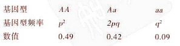

# 第13讲  生命的进化

事实1: 多样的物种具有不同的基因组

- 为何需要有不同数量的DNA 碱基对？
- 不同生物为何有不同数量的基因？
- 为何高等生物有更大的基因组，但是基因的数量变化很小？

事实2: 比较不同的物种发现，基因组里有大量“无用”的DNA序列，大脑中有大量“无用”的区域

### 基因组的进化包含了复制、重排和突变现象

- 基因的复制
  
- 新基因的诞生来自于基因重排的例子
  

- 基因突变使得进化成为可能

### 人类利用基因

- 比较基因组可以找到物种间的亲缘关系
- 利用基因组工具判别生物来源的例子
- 人类中的新冠突变分布追踪病毒来源

***种群***是一个能够杂交并产生可育后代的局部个体群体
***基因库***由群体中所有位点的所有等位基因组成

***等位基因***：染色体特定位点，同一基因的不同形式

- 如果一个基因座位上有两个或更多的等位基因，二倍体个体可能是纯合子或杂合子。
  
- 对于二倍体生物，一个位点上的等位基因总数是个体总数乘以2
- 一个位点的显性等位基因总数为每个纯合显性个体的两个等位基因加上每个杂合个体的一个等位基因；同样的逻辑也适用于隐性等位基因
- By convention, if there are two alleles at a locus, p and q are used to represent their frequencies
- The frequency of all alleles in a population will add up to 1
  - For example, p + q = 1

### ***The Hardy-Weinberg Equation(“哈迪-温伯格定律”)***

- 哈迪-温伯格方程描述了我们对一个没有在特定位点进化的群体所期望的遗传组成
- 如果观察到的种群遗传组成与哈迪·温伯格的预期不同，则表明种群可能正在进化
- 在配子随机产生下一代并发生孟德尔遗传的群体中，等位基因和基因型频率代代相传保持不变。这样的种群处于哈代-温伯格平衡。

- 哈迪-温伯格定理描述了一个没有进化的假设种群
- 在实际人群中，等位基因和基因型频率确实会随时间而变化

### 自然选择，遗传漂移和基因流动会改变一个群体中的基因频率